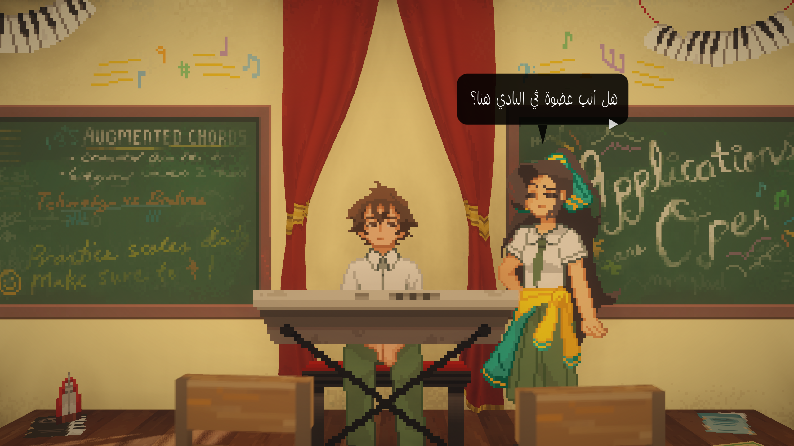
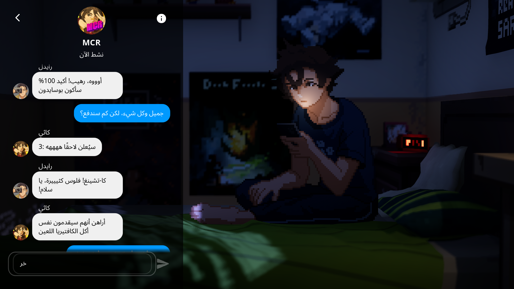
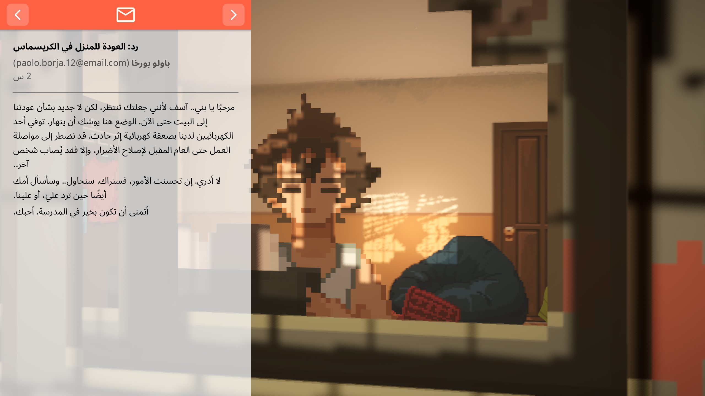
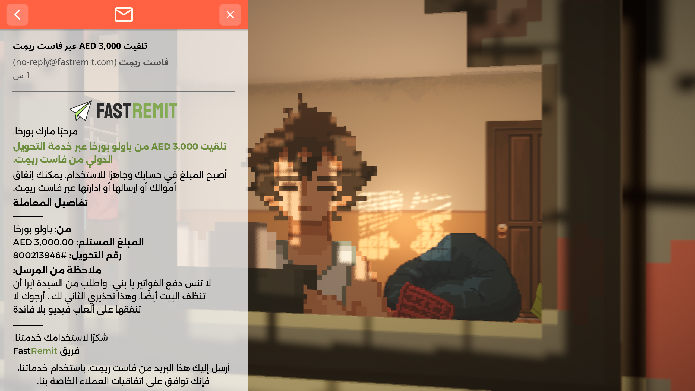
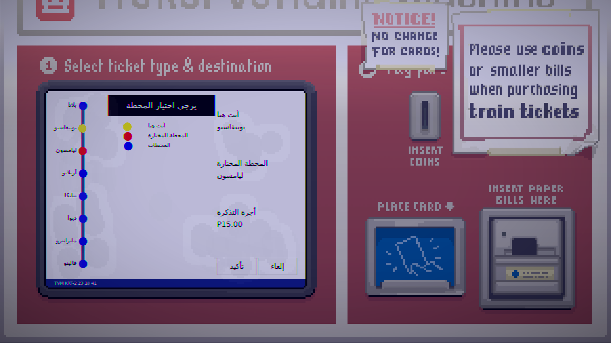
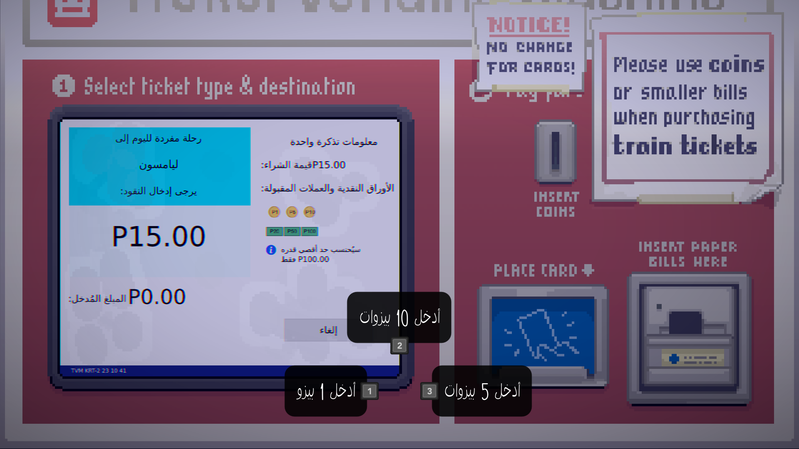
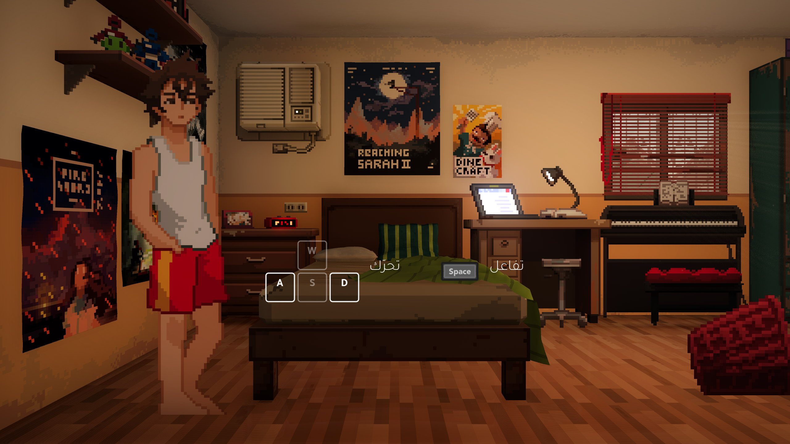

<div dir="rtl" align="right">

# تعريب Until Then


هنا تعريب Until Then، مع مراجعة يدوية سياقية للحوارات والضمائر وتوحيد أسماء الشخصيات والمصطلحات. اهتمّينا بالنصوص وبطريقة ظهورها داخل اللعبة، من خطوط عربية تناسب أجواءها إلى اتجاه الكتابة والمحاذاة وتأثيرات الحوار.

**التعريب والتدقيق:** [seven — @sevenlization](https://x.com/sevenlization)  
**النسخة:** Steam على Windows · **الحجم:** حوالي 6.4 MB .

## تحميل التعريب

### [⬇️ اضغط هنا لتحميل التعريب v0.11](https://github.com/79sk/Until-Then-Arabic/releases/download/v0.11/UntilThen_Arabic_v0.11_Sevenlization.zip)

[صفحة الإصدار](https://github.com/79sk/Until-Then-Arabic/releases/tag/v0.11) · [الإبلاغ عن مشكلة](https://github.com/79sk/Until-Then-Arabic/issues/new)

## وش يشمل التعريب؟

- الحوارات وخيارات الرد، مع مراجعة السياق والضمائر لكل الشخصيات.
- محادثات الجوال والرسائل الجماعية والبريد الإلكتروني والمنشورات.
- القوائم والإعدادات وتعليمات اللعب والتحكم.
- واجهات الألعاب المصغّرة والنصوص التي تظهر أثناء التفاعل معها.
- أسماء المحطات وواجهة شراء التذاكر والنصوص التفاعلية المرتبطة بها.
- أسماء ومصطلحات عالم اللعبة، بصياغة عربية أو نقل النطق للعربية حسب السياق.
- خطوط عربية صنعت بشكل خاص للعبة، مع ضبط الكتابة من اليمين لليسار ومحاذاة الأسطر وتأثيرات النص.

## طريقة التثبيت

1. أغلق اللعبة وفك ضغط الحزمة.
2. اذهب لمستطيل اللعبة بستيم واضغط **كليك يمين**، ثم اختر:

   `Manage → Browse local files`

3. انسخ الملفات الثلاثة التالية إلى مجلد اللعبة، بجوار `UntilThen.exe`:

   - `UntilThen.Arabic.pck`
   - `Sevenlization.gd`
   - `override.cfg`

4. شغّل اللعبة **من ستيم** واختر **الإنجليزية (English)** من إعدادات اللغة؛ التعريب يحل محل الإنجليزية.

**المسار الافتراضي لمجلد اللعبة:**

```text
C:\Program Files (x86)\Steam\steamapps\common\Until Then
```

اترك `UntilThen.pck` الأصلي كما هو. الملفات المضافة تقرأها اللعبة تلقائيًا، وما تحتاج تشغّلها بنفسك.

## صور من داخل اللعبة

الصور التالية من تجربة التعريب داخل اللعبة. اضغط على أي صورة لعرضها بحجمها الكامل.

### الحوارات ومحادثات الجوال

| الحوارات | محادثات الجوال |
| :---: | :---: |
| [](docs/screenshots/dialogue.png) | [](docs/screenshots/phone-chat.png) |

### البريد الإلكتروني والرسائل الطويلة

| البريد الإلكتروني | رسالة تحويل الأموال |
| :---: | :---: |
| [](docs/screenshots/email.png) | [](docs/screenshots/email-transfer.png) |

### المحطات وشراء التذاكر

| اختيار المحطة | شراء التذكرة |
| :---: | :---: |
| [](docs/screenshots/stations.png) | [](docs/screenshots/tickets.png) |

### تعليمات التحكم

[](docs/screenshots/controls.png)

## إزالة التعريب

1. أغلق اللعبة واحذف الملفات الثلاثة التي أضفتها: `UntilThen.Arabic.pck` و`Sevenlization.gd` و`override.cfg`.
2. اذهب لمستطيل اللعبة بستيم واضغط **كليك يمين**، ثم اختر:

   `Properties → Installed Files → Verify integrity of game files`

**مهم:** Verify لحاله ما يحذف الملفات المضافة، لذلك احذفها أولًا. التحقق يعيد ملفات اللعبة الأصلية إذا كانت عندك نسخة تعريب قديمة تستبدلها.

## لقيت مشكلة؟

افتح [بلاغًا هنا](https://github.com/79sk/Until-Then-Arabic/issues/new)، وأرفق صورة للنص مع اسم المشهد أو وصف المكان.

## حقوق التعريب

تم التعريب والتدقيق بواسطة **X: [@sevenlization](https://x.com/sevenlization)** بشكل مجاني، ولا يجوز بيعه أو الانتفاع منه ماديًا.

</div>

